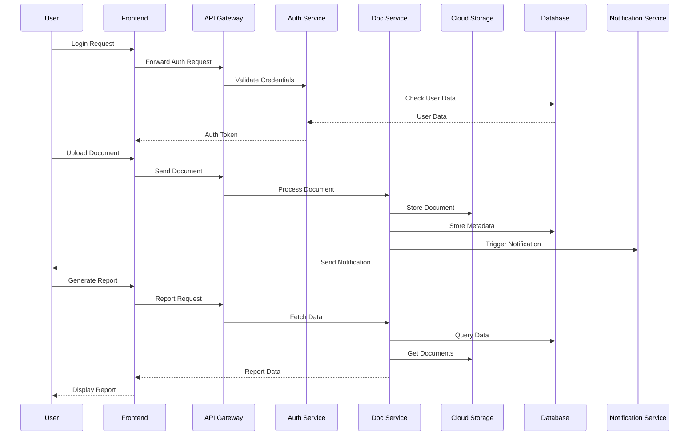

# ENGINUS Component Interaction Diagram

## Component Interaction Description

### Authentication Flow
1. User initiates login
2. Frontend forwards request through API Gateway
3. Auth Service validates credentials
4. Database confirms user data
5. Auth token returned to user

### Document Upload Flow
1. User uploads document
2. Request routed through API Gateway
3. Document Service processes upload
4. Document stored in Cloud Storage
5. Metadata saved to Database
6. Notification Service alerts relevant users

### Report Generation Flow
1. User requests report
2. API Gateway routes request
3. Document Service aggregates data
4. Data fetched from Database and Cloud Storage
5. Report generated and displayed to user

### Key Components

1. Frontend (FE)
   - User interface
   - Initial request handling
   - Response rendering

2. API Gateway (AG)
   - Request routing
   - Load balancing
   - Rate limiting

3. Auth Service (AS)
   - Credential validation
   - Token management
   - Session handling

4. Document Service (DS)
   - File processing
   - Version control
   - Metadata management

5. Cloud Storage (CS)
   - File storage
   - Data redundancy
   - Backup management

6. Database (DB)
   - Data persistence
   - Query handling
   - Transaction management

7. Notification Service (NS)
   - Event handling
   - Message queuing
   - Notification delivery
