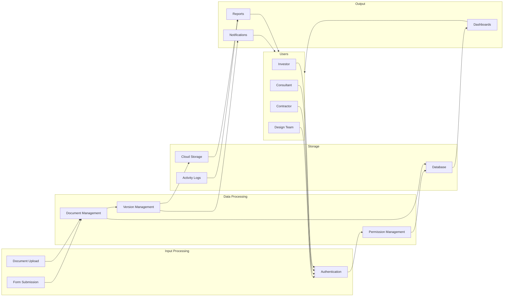

# ENGINUS Data Flow Diagram

## Data Flow Description

### Input Layer
1. User Authentication
   - Credential validation
   - Role verification
   - Session management

2. Document Processing
   - File upload handling
   - Metadata extraction
   - Format validation

3. Form Processing
   - Data validation
   - Field normalization
   - Input sanitization

### Processing Layer
1. Version Management
   - Version tracking
   - Change history
   - Rollback capability

2. Permission Management
   - Access control
   - Role-based permissions
   - Project-level authorization

3. Document Management
   - Storage organization
   - Metadata management
   - Search indexing

### Storage Layer
1. Cloud Storage
   - Document files
   - Binary assets
   - Backup data

2. Database
   - User data
   - Project metadata
   - System configurations

3. Activity Logs
   - User actions
   - System events
   - Audit trails

### Output Layer
1. Reports
   - Custom reports
   - Status updates
   - Analytics

2. Notifications
   - Real-time alerts
   - Email notifications
   - System messages

3. Dashboards
   - Project overview
   - Status monitoring
   - Performance metrics
