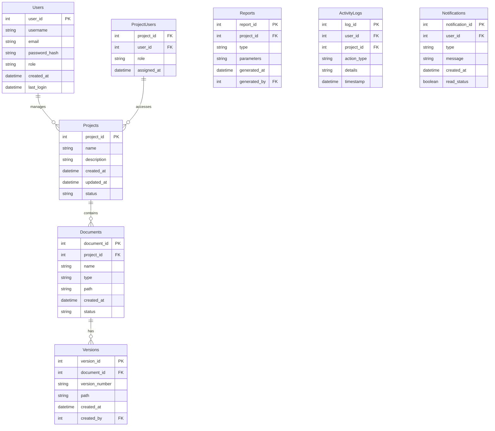

# ENGINUS Database Schema Diagram

## Database Schema Description

### Core Tables

1. Users
   - Stores user account information
   - Manages authentication data
   - Tracks user activity

2. Projects
   - Contains project metadata
   - Manages project lifecycle
   - Links to related documents

3. Documents
   - Stores document information
   - Manages file metadata
   - Links to physical files

### Relationship Tables

1. ProjectUsers
   - Maps users to projects
   - Manages project roles
   - Controls access levels

2. Versions
   - Tracks document versions
   - Maintains version history
   - Links to document files

### Tracking Tables

1. Reports
   - Stores report configurations
   - Tracks report generation
   - Manages report parameters

2. ActivityLogs
   - Records user actions
   - Maintains audit trail
   - Tracks system events

3. Notifications
   - Manages user notifications
   - Tracks notification status
   - Handles message delivery

### Key Relationships

1. User-Project Relationship
   - Many-to-many through ProjectUsers
   - Role-based access control
   - Project membership tracking

2. Project-Document Relationship
   - One-to-many relationship
   - Document organization
   - Project content management

3. Document-Version Relationship
   - One-to-many relationship
   - Version control
   - Change tracking
