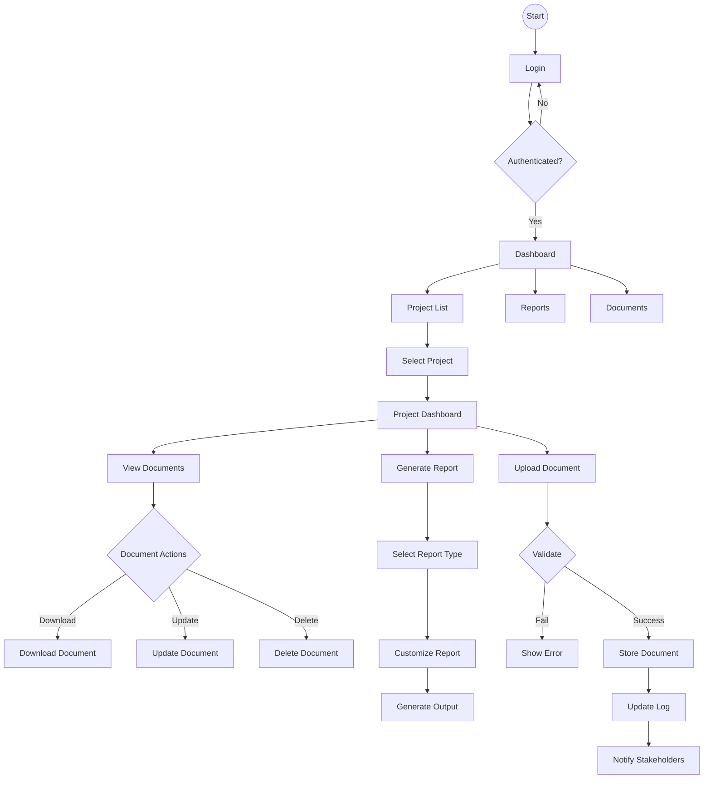

# ENGINUS User Flow Diagram

## User Flow Description

### Authentication Flow
1. User starts at login page
2. Enters credentials
3. If authentication fails, returns to login
4. If successful, proceeds to dashboard

### Project Management Flow
1. View list of accessible projects
2. Select specific project
3. Access project dashboard
4. View project documents and reports

### Document Management Flow
1. View document list
2. Upload new documents
3. Perform actions on existing documents
   - Download
   - Update
   - Delete
4. System logs actions
5. Stakeholders receive notifications

### Report Generation Flow
1. Select report type
2. Customize report parameters
3. Generate and view report
4. Export or share as needed
